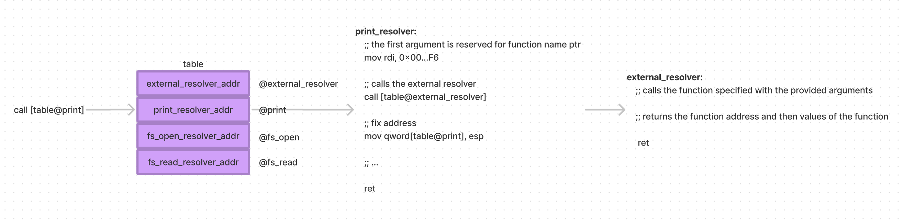

### GOALS

1. Fast single-pass mode.
2. Progressive optimisation.
3. Cacheable.

### MODES

Wasmo supports two modes of compilation:
1. Highly-Optimised Mode
2. Lift-Off Mode

The highly-optimised mode compiles the wasm binary once into executable code with important optimisations enabled. This is useful when the module is going to be cached for subsequent reuse, that is AOT use.

The lift-off mode compiles the wasm binary multiple times, progressively generating a more optimised executable with each iteration. Right now there will only be two iterations. Lift-off mode requires a hand-off process that can be a bit costly. This mode is useful for JIT scenarios where you need the module to start as fast as possible with deferred optimization.

We are using OrcV2 because it promises concurrent compilation and makes JITing a lot easier with support for loading and dumping object code. It also opens the possibility of profile-guided optimization in the future.

https://v8.dev/blog/liftoff

### LINKING AND RESOLUTION

When a wasm module is compiled, the internal functions and globals are resolved to their final addresses. But runtime context-dependent elements are not.

Context-dependent elements include:
1. Imported functions
2. Imported globals
3. All memories
4. All tables

These are resolved at instantiation time. Wasmo solves this borrowing ideas from PIC implementation using PLT and GOT.

One thing to note is that traditional linking is different from wasm module instantiation because the order in which external call are made is reversed.

In traditional linking, the in-memory executable asks for an external symbol (in a shared library) to be resolved, so the shared library is loaded into memory on as needed basis.
The shared library doesn't have to know anything about the in-memory executable.

In wasm's case however, you can think of the in-memory executables as the runtime context. Runtime context refers to imported functions, imported globals, memories and tables instantiated by the host. These objects are dynamic. Memories and globals for example cannot be shared between processes. On the other hand, the compiled module becomes the _shared library_ in this situation because it can be shared between different runtime contexts. But unlike traditional linking, the module (the _shared library_) calls the runtime context. This makes typical PIC and load-time relocation strategies unapplicable. It needs to modified.

For wasmo, we generate a `_link_resolver` function and a _special data section_ for every module. These properties are inaccessible to internal WebAssembly functions.
The `_link_resolver` function is called during instantiation and it sets the address of the external resolver function in the special data section.



### PROPOSED API

```rs
let imports = Imports::default(/* memories, tables, globals, functions */)?;
let module = Module::new(&bytes, options)?; // Compiles with unresolved symbols. Creates trampolines.
let instance = Instance::new(&module, &imports)?; // Links memory pieces. Makes imported functions where accessible.
```

```rs
module.dump(); // Module should be serializable to Vec<u8>.
```

```rs
module.clone(); // Module should be cloneable.
```

### EMBEDDING

```
Store {
    init() -> { funcs, mems, globals, tables }
}

Module {
    decode(Vec<u8>) -> Module? // wasm binary
    parse(String) -> Module? // wat text
    validate(&self) -> ()?
    instantiate() => (Store, Instance?)
    imports() -> Vec<(String, String, ExternType)>
    exports() -> Vec<(String, ExternType)>
}

Instance {
    export(Module, String) -> (String, ExternType)
}

Function {
    alloc(Store, FuncType, HostFunc) -> (Store, FuncAddr)
    type(Store, FuncAddr) -> FuncType
    invoke(Store, FuncAddr, Vec<Value>) -> (Store, Vec<Value>)
}

Table {
    alloc(Store, FuncType, Ref) -> (Store, TableAddr)
    ...
}

Memory {
    ...
}

Global {
    ...
}
```

https://webassembly.github.io/spec/core/appendix/embedding.html
